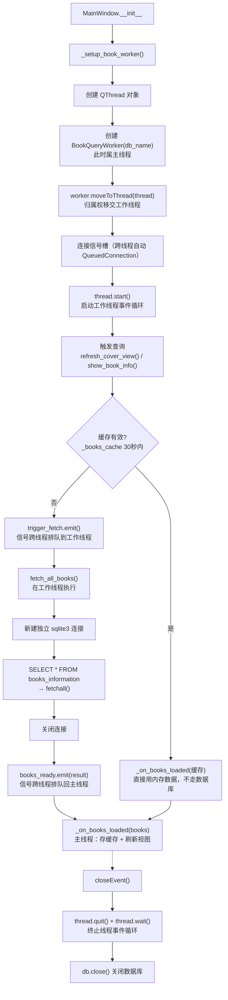
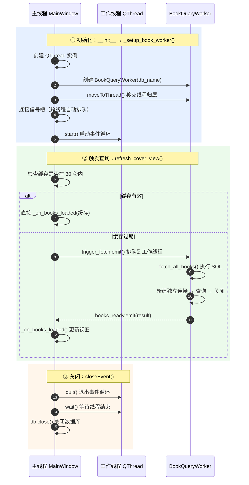

# 后台查询线程机制梳理 —— BookQueryWorker 的完整流程

> 本文件梳理主线程如何创建后台线程、并用 `BookQueryWorker` 执行数据库查询的完整逻辑。
> 相关代码：`el_gui.py` 的 `_setup_book_worker()` / `refresh_cover_view()` / `_on_books_loaded()` / `closeEvent()`，以及 `database.py` 的 `BookQueryWorker`。

---

## 一、总览流程图（生命周期）

---

## 二、跨线程时序图（信号传递细节）

---

## 三、逐步文字梳理

### ① 初始化阶段（el_gui.py:79 `_setup_book_worker`）

1. `self._query_thread = QThread()` —— 建一个线程对象，此时还没跑起来。
2. `BookQueryWorker(self.db.db_name)` —— 建 worker，**此刻它和主线程的普通对象没有区别**。
3. `moveToThread(thread)` —— 关键一步：把 worker 的**线程归属**从主线程移交给工作线程。此后凡是经由信号触发的 worker 槽函数，都会在工作线程里执行。
4. 连接三根信号：
   - `books_ready → _on_books_loaded`（查询结果回主线程）
   - `query_error → _on_query_error`（错误提示）
   - `trigger_fetch → fetch_all_books`（触发查询）
   因为收发双方不在同一线程，Qt 自动按 **QueuedConnection（排队）** 处理。
5. `thread.start()` —— 线程进入事件循环，等待信号投递。

### ② 触发查询阶段（el_gui.py:340 `refresh_cover_view`）

6. 先看缓存：30 秒内直接 `_on_books_loaded(缓存)`，完全避开数据库。
7. 缓存过期才 `trigger_fetch.emit()` —— 这个信号从主线程发出，**排队到工作线程的事件循环**，由工作线程执行 `fetch_all_books`。
8. worker 在工作线程里 `sqlite3.connect(db_name)` 新建**独立连接**（database.py:337），执行 `SELECT *` 后 `conn.close()`（查完即关）。因为连接在工作线程内创建和使用，天然满足 SQLite 线程安全要求。
9. `books_ready.emit(result)` —— 结果信号又排队回到**主线程**，触发 `_on_books_loaded`，在主线程里更新缓存、刷新视图、更新状态栏。

### ③ 关闭阶段（el_gui.py:441 `closeEvent`）

10. `quit()` 让事件循环退出，`wait(3000)` 阻塞等线程真正结束（防止窗口销毁后线程还在访问已释放的资源），最后 `db.close()`。

---

## 四、核心要点

- **"moveToThread 之后再连接的信号槽 = 跨线程安全"**：主线程发 `trigger_fetch`，工作线程发 `books_ready`，两边各自在自己的事件循环里处理，谁都不会阻塞谁。
- **worker 不碰主线程的连接**：它只拿数据库文件名，每次查询自建自关连接，这就是它和主线程 `DatabaseManager` 长连接互不冲突的原因。
- **为什么这样设计**：SQLite 连接不能跨线程共享（详见 [线程方案](../../guide/threading-solution.html) 与数据库查询方案）。
